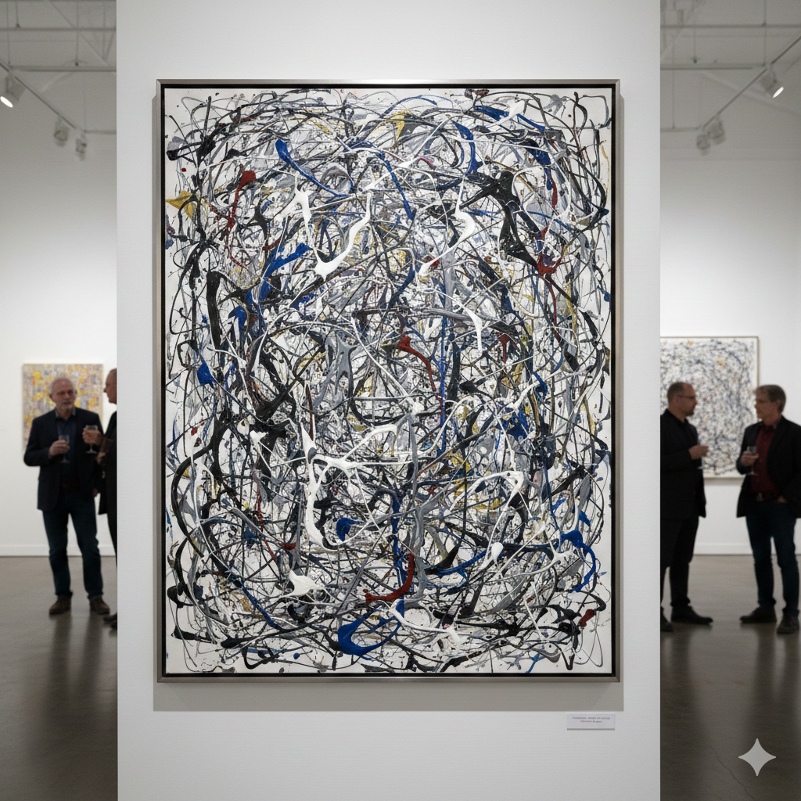

There was a time when I had a very narrow definition of what counted as “good” art.

If I walked into a gallery and saw something abstract or unconventional, my first reaction was dismissive. I would think, I could do that. That is not art.

It felt like a reasonable standard. If I could reproduce it, how impressive could it be?

Then a friend reframed it for me.

They suggested that the measure of art is not whether you could physically do it. The real question is whether you would have thought to do it first.

That distinction changed everything.

### The Pollock Problem

Consider Jackson Pollock.

At first glance, many people see splatters of paint and assume randomness. The common reaction is the one I used to have. A kid could do that. I could do that.

But Pollock did it first. He broke convention. He challenged assumptions about what painting even was. The act of dripping and splattering paint became part of the art itself.

The innovation was not in technical perfection. It was in the conceptual leap.

You may not like it. You may not hang it in your home. But you cannot deny that it shifted the conversation.

Real innovation often looks messy at first. Confusing. Easy to dismiss.

### Enter AI

I think about that shift almost daily in this new AI saturated world.

There is a lot of judgment flying around.

If someone uses AI to draft a memo, generate a slide deck, summarize a meeting, or outline a strategy, the criticism often sounds familiar:

That is not real work.
That is cheating.
I could have done that myself.

Maybe you could have.

But did you think to do it that way?

Did you imagine orchestrating systems, prompts, and workflows to compress hours into minutes? Did you reframe your role from sole producer to director of a system that produces?

We may be in the early abstract expressionist phase of AI. The outputs can look rough. Some are derivative. Some feel like paint splatters.

But underneath that surface is a deeper shift in how work itself gets defined.

### I Want the Full Measure of These Tools

For me, this is not about blindly adopting AI or defending it at all costs.

It is about understanding it.

I want the full measure of these tools. That means using them. Pushing them. Stress testing them. Building workflows around them. Breaking those workflows. Rebuilding them better.

You do not really understand a new medium by standing outside it and critiquing it. You understand it by working inside it.

If AI is reshaping how knowledge work happens, I want to see the shape clearly. I want to understand where it accelerates thinking and where it dulls it. Where it creates leverage and where it creates dependency.

Discernment only comes from use.

### Shaping the Conversation

There is also a bigger responsibility here.

If the loudest voices in the room are either utopian or apocalyptic, the outcome will likely swing too far in one direction.

I want to help shape the conversation toward something more grounded.

Responsible use of AI is not optional. It is foundational.

That means:

* Designing systems that enable workers rather than quietly displace them.
* Being transparent about how AI is used in decision making.
* Investing in upskilling so people can move up the value chain instead of being pushed out of it.
* Building governance and guardrails before scale, not after damage.

The goal should not be replacement.

The goal should be augmentation.

AI can handle repetition, synthesis, and first drafts at scale. Humans bring context, ethics, taste, and accountability. The combination is where the real leverage lies.

### From Judgment to Stewardship

Whenever a new tool emerges, there is a wave of skepticism. Some of it is healthy. Some of it is fear.

Photography was once dismissed as mechanical. Digital art was not considered real art. Electronic music was written off as artificial.

Now AI faces its own version of that critique.

Some concerns are valid. Overreliance, bias, misuse, and workforce disruption are real issues. Pretending otherwise is irresponsible.

But dismissing the entire medium because it feels unfamiliar is equally shortsighted.

If we are in the Jackson Pollock phase of AI, then our job is not just to critique the splatters.

It is to experiment with the medium responsibly. To understand its contours. To build norms. To set standards. To insist that it be used in ways that expand human capability rather than diminish it.

Curiosity over contempt.

Stewardship over cynicism.

That feels like a better starting point for whatever this new way of working becomes.
